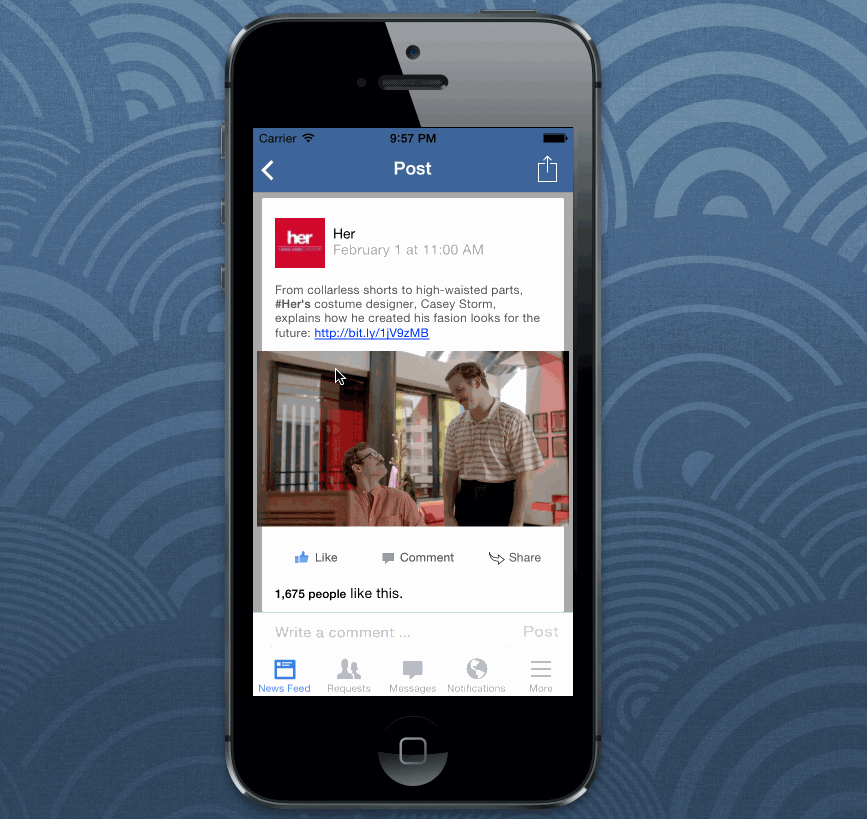

Week 1 Homework

## How many hours to complete ?

10 Hrs

## Which required and optional stories have been completed ?

- ✓ Add container view and modified different properties
- ✓ Add buttons with different images for default and highlighted state
- ✓ Add UIImage views and choose the right mode
- ✓ Add UITextField with background image
- ✓ Add UILabels with attributed text (instead of plain) to bold individual words
- ✓ Optional: Move the textfield when the keyboard appears
- ✓ Optional: Setup CocoaPods for managing 3rd party libraries and use TTAttributedLabel to style link etc
- ✓ Optional: Configure the autoresizingMasks to support rotation
- x Optional: Implement the same page programmatically without using Interface
  Builder

## Walkthrough

